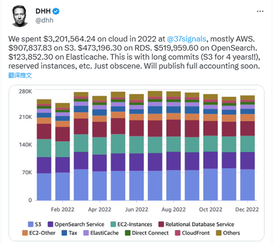

## 凡事无绝对

今天早上醒来打开手机就看到了一篇推送过来的关于中台可以休矣的文章，观点与企业不必再招DBA一样的极端偏颇。本想今天就写一篇探讨一下，后来想想，还是先继续谈谈昨天没讲完的37Signals从公有云撤退的一些感受，我主要是怕不趁热把这些想法记录下来，过两天会丢失很多思想。 昨天的文章因为篇幅问题，只谈了成本的问题。不过如果仅仅是成本问题，那么37Signals从公有云撤退后还应该继续使用K8S，但是他们连K8S都放弃了，改为私有云虚拟机+DOCKER，就值得我们更仔细的去研究一番了。为了更好的了解这个事件，我一大早又看了一遍rework对David和37Signals COO Eron Nicholson的访谈的文字稿。实际上从访谈中我们可以获得更多的值得思考的线索，不过很多内容不在今天要讨论的范围内，以后找机会再聊吧。 从这个访谈中，我看到了很多对于这个问题思考的细节，David他们当初上云的目的是解决IT的复杂性问题，他们可能会面临系统上线两周后的几十万访问的尖峰，公有云很好的帮他们渡过了这个时期。随着业务的不断成熟与扩大，系统变得很平稳，没有黑色星期五的销售量暴增，也没有圣诞假期的低谷。于是业务的发展，IT系统的负载变得十分容易预测了，因此需要公有云解决的复杂性问题不存在了。此时带来了一些新的复杂性，公有云对于37Signals来说是一个黑匣子，它是否真的安全、可靠，只有出了问题才知道，在此之前，它就像一场梦一样不可捉摸。

37Signals付出了高额的成本，但是他们还是买不起更高级别的服务，亚马逊并不接听他们的电话，遇到的所有问题也必须由他们自己的团队来解决。因此上云数年后公有云并没有真正帮他们解决掉复杂性的问题，只是让他们的运营成本变得更高了。
对于他们回归自营虚拟机+DOCKTER，则是对复杂性的另一个思考，他们认为K8S太复杂了，其陡峭的学习曲线让他们感到力不从心。当一切都正常时，大家都觉得K8S很不错，用起来很省心，但是一旦出问题的时候，他们是无力解决这些问题的。对于一个拥有数十万注册用户，但是只有80多人的中型SAAS服务商来说，很好的掌握K8S并不是一件容易的事情，因此他们最后决定将K8S上的应用退回导虚拟机+DOCKER的环境中，复杂度的降低让他们对整个系统的把控能力提升了许多，他们的十几个人的运营团队可以十分轻松的把控整个平台和系统了。而之前他们的系统一直为不太必要的系统复杂性的可能性买单，从而面临诸多的运维挑战。
大型互联网企业的业务面临巨大的不确定的负载挑战，因此他们的系统可以面向各种各样的复杂性。因此他们从头到尾构建了一套IT体系，从研发到运营，这套体系是完全适应这个IT基础平台和技术堆栈的。近些年来，大型互联网企业也在做技术输出，很多传统企业也接受了这种技术输出。但是这些传统企业往往只能学到其表面，而无法做到表里一体。因此他们引入大型互联网企业的技术的同时引入了IT的复杂性，但是并没办法掌握解决复杂性问题的方法。同时，这些企业的业务与互联网企业完全不同，他们也并没有那么多的复杂性要去解决。他们实际上并不需要掌握解决这些复杂性的钥匙，因此他们拿到钥匙之后并不知道门在哪里。
实际上很多企业或者团队低估了复杂性所带来的成本，因此过于强调了敏捷和可扩展性带来的好处。这几年我一直跟踪一个项目，这是一个面向近百万用户使用的管理类系统，其在线用户舒最终会突破10万。最初设计是从以前的Oracle数据库迁移到RDS Mysql作为数据库。他们最初选择了32C/128GB的标准RDS实例，每个数据库不超过500GB容量。在研发过程中，他们解决了很多分库分表的难题，通过一年多的时间，终于完成了应用的改造。上线试运行阶段他们解决了大量的性能问题，对数据库做了进一步的拆分。不过随后他们发现，如果完成整个系统上线，数据库系统将需要被拆分为120+个RDS实例，而如果为了进一步提升处理能力，为今后系统长期运行做准备，必须使用读写分离的方式，如果这样，他们可能需要将整个系统拆分为360+实例。在一个系统中运维如此大的RDS实例数量，让他们感到恐惧。
为了解决数据库的复杂性问题，他们又开始对数据库实例进行合并，将120+的数据库实例都改为最大规格的90C/720GB的MYSQL实例。这样就把数据库实例的数量减少为40+，不过每个数据库的容量也变成了1.5TB。看到这个新的数据库设计，很多人觉得放心多了，不过我也提出了一个新的问题，运维一个23C/128GB，小于500GB的MYSQL数据库实例与运维一个90C/720GB，1.5TB的MYSQL实例的难度相同吗？我想很多了解MYSQL，深度使用过MYSQL的朋友心里已经有答案了。
对于需要长期运行的系统来说，复杂性必然带来额外的成本，增加的成本的高低取决于系统本身的属性。因此解决IT系统的复杂性是我从事IT工作这三十多年来很多企业一直在考虑的问题。IOE架构也是因为它解决了企业IT建设与运营的复杂性而得到了极大的发展。云平台实际上也是解决了IT的复杂性而得到了极大的发展，它让用户不需要考虑底层IT基础设施与平台的复杂性，而可以更多的去关注企业的业务。
实际上前面所举的例子并不需如此复杂，实际上近百万用户是按省为单位使用这个系统的，这套系统完全可以按照省为单位拆分为多套系统。每套系统的应用、数据库都可以独立部署，因为除了总部的统计分析业务外，用户不会跨省办理业务，而统计分析完全可以在数据中台或者数据仓库里完成。
近些年一些企业的IT似乎陷入了一个思维怪圈，放弃了原有的简单设计，从而选择了一个更为复杂，似乎也更为先进的技术堆栈。不过在这些设计中引入的复杂性，早晚还是会以运营成本的方式给予回报的。复杂性也是IT成本这个问题，早晚会引起人们的广泛思考的。

## Nothing is absolute

When I woke up this morning and turned on my phone, I saw a pushed article about the end of China and Taiwan. The view was as extreme as the idea that companies no longer need to hire DBAs. I originally wanted to write an article today to discuss it, but then I thought about it, so I’d better continue talking about some of the feelings about 37Signals’ withdrawal from the public cloud that I didn’t finish yesterday. I’m mainly afraid that I won’t record these thoughts while they’re hot. I’ll post them in two days. Lost a lot of ideas. Due to space constraints, yesterday’s article only talked about cost. However, if it is just a matter of cost, then 37Signals should continue to use K8S after withdrawing from the public cloud. However, they even gave up K8S and changed to private cloud virtual machine + DOCKER, which is worthy of our more careful study. In order to better understand this incident, I read again the transcript of rework’s interview with David and 37Signals COO Eron Nicholson early in the morning. In fact, we can get more clues worth thinking about from the interviews, but many of them are beyond the scope of today's discussion. Let's talk about it later when we have an opportunity. From this interview, I saw a lot of details about thinking about this issue. David and his colleagues originally moved to the cloud to solve complex IT problems. They may face a peak of hundreds of thousands of visits two weeks after the system goes online. Public cloud It helped them get through this period very well. As the business continues to mature and expand, the system has become very stable, with no Black Friday sales spikes or Christmas holiday slumps. As business develops, the load on IT systems becomes very easy to predict, so the complex problems that need to be solved by the public cloud no longer exist. This brings some new complexities. The public cloud is a black box for 37Signals. Whether it is really safe and reliable will only be known if something goes wrong. Before that, it was as elusive as a dream.



37Signals paid a high cost, but they still couldn't afford a higher level of service, Amazon didn't answer their calls, and all issues they encountered had to be resolved by their own team. Therefore, after several years of moving to the cloud, the public cloud did not really help them solve the complexity problem, but only made their operating costs higher. For their return to self-operated virtual machines + DOCKTER, it is another reflection on complexity. They believe that K8S is too complicated, and its steep learning curve makes them feel inadequate. When everything is normal, everyone thinks K8S is very good and easy to use, but when problems arise, they are unable to solve them. For a medium-sized SAAS service provider with hundreds of thousands of registered users but only more than 80 people, it is not easy to master K8S well, so they finally decided to return the applications on K8S to virtual machines + DOCKER In the environment, the reduction of complexity has greatly improved their ability to control the entire system. Their operations team of more than a dozen people can control the entire platform and system very easily. Previously, their systems had been paying for the possibility of unnecessary system complexity, thus facing many operation and maintenance challenges. The businesses of large Internet companies face huge uncertain load challenges, so their systems can face a variety of complexities. Therefore, they built an IT system from beginning to end, from R&D to operation. This system is fully adapted to the IT basic platform and technology stack. In recent years, large Internet companies have also been exporting technology, and many traditional companies have also accepted this technology export. However, these traditional enterprises often can only learn the surface, but cannot integrate the inside and outside. Therefore, while they introduced the technology of large Internet companies, they also introduced the complexity of IT, but they were unable to master the methods to solve the complexity problem. At the same time, the businesses of these companies are completely different from Internet companies, and they do not have so many complexities to solve. They don't actually need to have the key to solve these complexities, so they get the key and don't know where the door is. In fact, many companies or teams underestimate the cost of complexity and therefore overemphasize the benefits of agility and scalability. I have been tracking a project in the past few years. This is a management system for nearly one million users. Its online users will eventually exceed 100,000. The original design was to migrate from the previous Oracle database to RDS Mysql as the database. They initially chose a 32C/128GB standard RDS instance with a capacity of no more than 500GB per database. During the research and development process, they solved many problems of sub-database and sub-table, and after more than a year, they finally completed the transformation of the application. During the online trial operation phase, they solved a large number of performance problems and further split the database. But then they discovered that if the entire system was completed, the database system would need to be split into 120+ RDS instances. In order to further improve processing capabilities and prepare for long-term operation of the system in the future, read-write separation must be used. If This way, they may need to split the entire system into 360+ instances. Operating and maintaining such a large number of RDS instances in one system terrifies them. In order to solve the problem of database complexity, they began to merge database instances and changed all 120+ database instances to the largest 90C/720GB MYSQL instance. This reduces the number of database instances to 40+, but the capacity of each database also becomes 1.5TB. Seeing this new database design, many people feel more relieved, but I also raised a new question, between operating and maintaining a 23C/128GB, less than 500GB MYSQL database instance and operating and maintaining a 90C/720GB, 1.5TB MYSQL Are the instances of the same difficulty? I think many friends who know MYSQL and have used MYSQL in depth already have the answer in their minds. For systems that require long-term operation, complexity will inevitably bring additional costs, and the increased cost depends on the properties of the system itself. Therefore, solving the complexity of IT systems is an issue that many companies have been considering for more than 30 years since I have been working in IT. The IOE architecture has also developed greatly because it solves the complexity of enterprise IT construction and operations. The cloud platform has actually solved the complexity of IT and has developed greatly. It allows users to not need to consider the complexity of the underlying IT infrastructure and platform, but can focus more on the business of the enterprise. In fact, the example mentioned above does not need to be so complicated. In fact, nearly one million users use this system on a provincial basis. This system can be split into multiple systems on a provincial basis. The applications and databases of each system can be deployed independently, because except for the statistical analysis business of the headquarters, users will not handle business across provinces, and statistical analysis can be completed in the data center or data warehouse. In recent years, the IT of some enterprises seems to have fallen into a strange thinking circle, abandoning the original simple design and choosing a more complex and seemingly more advanced technology stack. However, the complexity introduced in these designs will sooner or later be rewarded in the form of operating costs. Complexity is also an issue of IT cost, which will arouse people's extensive thinking sooner or later.
